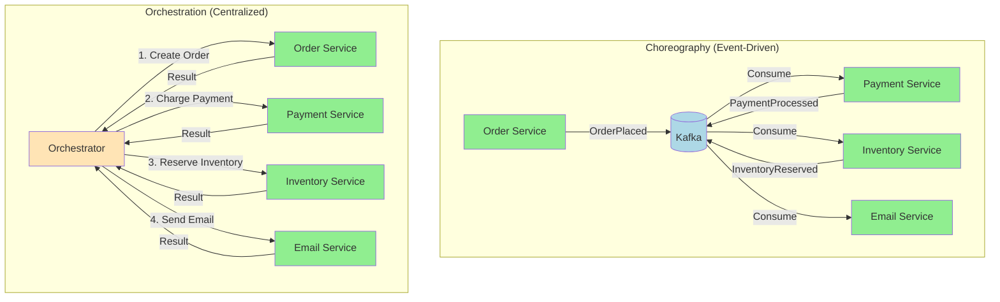
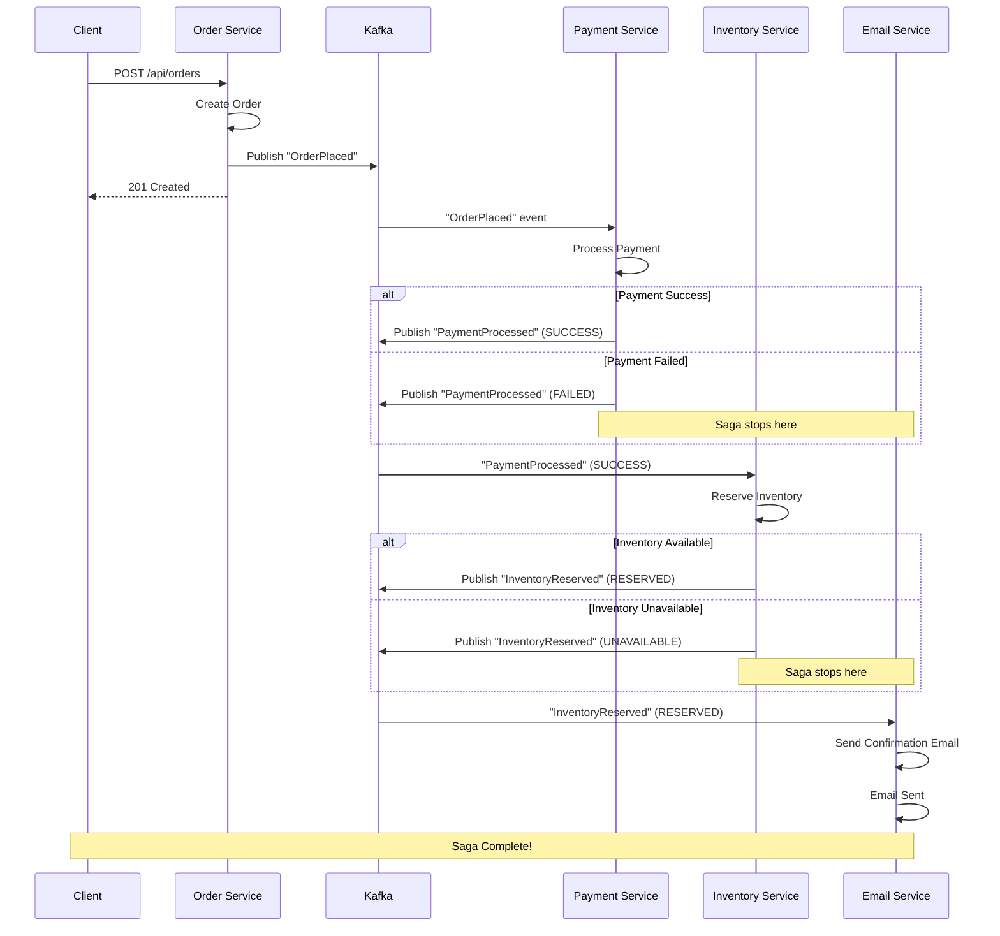
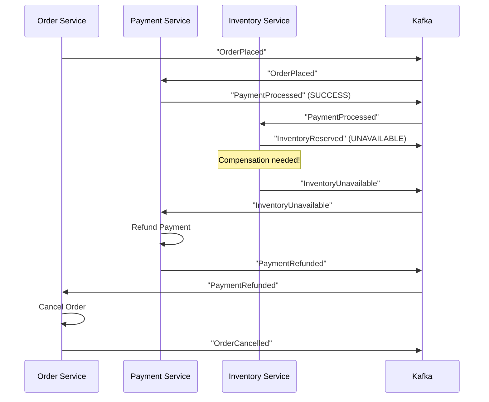

# Day 10: Saga Pattern and Event Choreography

## Welcome to Distributed Transactions!

You've learned to publish events and handle them reliably. But what happens when you need to coordinate multiple services to complete a business transaction? Today, you'll learn about the Saga Pattern — the way to handle distributed transactions in microservices.

Think of it like this:
- **Traditional transactions**: Like a bank transfer — both accounts update or neither does (atomic)
- **Distributed systems**: Like coordinating a wedding — multiple vendors (caterer, photographer, venue) need to work together, but they're independent
- **Saga Pattern**: Like a wedding coordinator — ensures everything happens in the right order, with a plan to undo if something goes wrong

---

## What We'll Build Today

By the end of this day, you'll understand:
- How to coordinate distributed transactions with Kafka events
- Saga orchestrator vs choreography models
- Building an event-based Saga flow
- Implementing Order → Payment → Inventory → Notification flow
- Compensating transactions (undoing work when things fail)

---

## Understanding Distributed Transactions

### The Problem

In a monolith, you can use database transactions:

```java
@Transactional
public void processOrder(Order order) {
    orderRepository.save(order);        // ✅
    paymentService.charge(order);       // ✅
    inventoryService.reserve(order);    // ✅
    emailService.sendConfirmation();    // ✅
    // All succeed or all fail (ACID)
}
```

In microservices, each service has its own database:

```java
// Service 1: Order Service
orderRepository.save(order);  // ✅ Committed

// Service 2: Payment Service (different database!)
paymentService.charge(order);  // ❌ Fails

// Problem: Order is saved but payment failed!
// Can't rollback order (different database)
```

**Result**: Inconsistent state across services!

### Why Traditional Transactions Don't Work

**ACID transactions** require:
- **Atomicity**: All or nothing
- **Consistency**: Valid state
- **Isolation**: Concurrent transactions don't interfere
- **Durability**: Committed changes persist

**In distributed systems**:
- Each service has its own database
- No shared transaction coordinator
- Network partitions can occur
- Services can fail independently

**Solution**: Saga Pattern — coordinate without distributed transactions!

---

## What is the Saga Pattern?

A **Saga** is a sequence of local transactions, each coordinated by events.

### Key Concepts

1. **Local Transaction**: Each service performs its work in its own database
2. **Event Publishing**: After each step, publish an event
3. **Event Consumption**: Next service consumes event and performs its work
4. **Compensation**: If something fails, undo previous steps

### Two Approaches

#### 1. Choreography (Event-Driven)

**How it works**: Services listen to events and react independently.

```
Order Service → publishes "OrderPlaced"
    ↓
Payment Service → consumes "OrderPlaced" → publishes "PaymentProcessed"
    ↓
Inventory Service → consumes "PaymentProcessed" → publishes "InventoryReserved"
    ↓
Email Service → consumes "InventoryReserved" → sends email
```

**Pros**: 
- Decoupled services
- No central coordinator
- Easy to add new services

**Cons**:
- Hard to track overall flow
- Difficult to handle complex flows
- Compensation logic scattered

#### 2. Orchestration (Centralized)

**How it works**: Central orchestrator coordinates the flow.

```
Orchestrator → tells Order Service to create order
    ↓
Orchestrator → tells Payment Service to charge
    ↓
Orchestrator → tells Inventory Service to reserve
    ↓
Orchestrator → tells Email Service to send
```

**Pros**:
- Clear flow visibility
- Centralized compensation logic
- Easier to handle complex flows

**Cons**:
- Orchestrator is a single point of failure
- More coupling
- Orchestrator needs to know all services

---

## Visual: Choreography vs Orchestration



---

## Building Event-Based Saga (Choreography)

We'll build the choreography approach using Kafka events. This is the most common pattern in event-driven architectures.

### Example Flow: Order Processing

```
1. Order Service: Create order → Publish "OrderPlaced"
2. Payment Service: Charge customer → Publish "PaymentProcessed" or "PaymentFailed"
3. Inventory Service: Reserve items → Publish "InventoryReserved" or "InventoryUnavailable"
4. Email Service: Send confirmation → Publish "EmailSent"
```

### Step 1: Create Additional Events

Create `src/main/java/com/example/kafka/event/PaymentProcessedEvent.java`:

```java
package com.example.kafka.event;

import java.math.BigDecimal;
import java.time.LocalDateTime;

public record PaymentProcessedEvent(
    // Business Data
    String paymentId,
    String orderId,
    String customerId,
    BigDecimal amount,
    String status,  // "SUCCESS" or "FAILED"
    LocalDateTime processedAt,
    // Event Metadata
    String eventType,        // "PaymentProcessed"
    String eventVersion,     // "1.0"
    String source,           // "payment-service"
    String transactionId,    // For saga correlation
    LocalDateTime timestamp  // Event creation time
) {
}
```

Create `src/main/java/com/example/kafka/event/InventoryReservedEvent.java`:

```java
package com.example.kafka.event;

import java.time.LocalDateTime;

public record InventoryReservedEvent(
    // Business Data
    String reservationId,
    String orderId,
    String productId,
    Integer quantity,
    String status,  // "RESERVED" or "UNAVAILABLE"
    LocalDateTime reservedAt,
    // Event Metadata
    String eventType,        // "InventoryReserved"
    String eventVersion,     // "1.0"
    String source,           // "inventory-service"
    String transactionId,    // For saga correlation
    LocalDateTime timestamp // Event creation time
) {
}
```

### Step 2: Create Payment Service Consumer

Create `src/main/java/com/example/kafka/consumer/PaymentServiceConsumer.java`:

```java
package com.example.kafka.consumer;

import com.example.kafka.event.OrderPlacedEvent;
import com.example.kafka.event.PaymentProcessedEvent;
import com.example.kafka.service.PaymentEventProducer;
import org.slf4j.Logger;
import org.slf4j.LoggerFactory;
import org.springframework.kafka.annotation.KafkaListener;
import org.springframework.kafka.support.KafkaHeaders;
import org.springframework.messaging.handler.annotation.Header;
import org.springframework.messaging.handler.annotation.Payload;
import org.springframework.stereotype.Component;

import java.math.BigDecimal;
import java.time.LocalDateTime;
import java.util.UUID;

@Component
public class PaymentServiceConsumer {
    
    private static final Logger log = LoggerFactory.getLogger(PaymentServiceConsumer.class);
    private final PaymentEventProducer paymentEventProducer;
    
    public PaymentServiceConsumer(PaymentEventProducer paymentEventProducer) {
        this.paymentEventProducer = paymentEventProducer;
    }
    
    @KafkaListener(
        topics = "orders",
        groupId = "payment-service-group"
    )
    public void handleOrderPlaced(@Payload OrderPlacedEvent event) {
        log.info("Payment Service: Received OrderPlaced event for order: {}", event.orderId());
        
        try {
            // Simulate payment processing
            boolean paymentSuccess = processPayment(event);
            
            // Publish result
            var paymentEvent = new PaymentProcessedEvent(
                UUID.randomUUID().toString(),
                event.orderId(),
                event.customerId(),
                event.totalAmount(),
                paymentSuccess ? "SUCCESS" : "FAILED",
                LocalDateTime.now(),
                "PaymentProcessed",
                "1.0",
                "payment-service",
                event.transactionId(),
                LocalDateTime.now()
            );
            
            paymentEventProducer.sendPaymentProcessedEvent(paymentEvent);
            
            log.info("Payment Service: Payment processed for order: {}, Status: {}", 
                event.orderId(), paymentEvent.status());
            
        } catch (Exception e) {
            log.error("Payment Service: Error processing payment for order: {}", 
                event.orderId(), e);
            
            // Publish failure event
            var failureEvent = new PaymentProcessedEvent(
                UUID.randomUUID().toString(),
                event.orderId(),
                event.customerId(),
                event.totalAmount(),
                "FAILED",
                LocalDateTime.now(),
                "PaymentProcessed",
                "1.0",
                "payment-service",
                event.transactionId(),
                LocalDateTime.now()
            );
            
            paymentEventProducer.sendPaymentProcessedEvent(failureEvent);
        }
    }
    
    private boolean processPayment(OrderPlacedEvent event) {
        // Simulate payment processing logic
        // In real system: call payment gateway, validate card, etc.
        
        // Simulate: Fail if amount > 1000
        if (event.totalAmount().compareTo(BigDecimal.valueOf(1000)) > 0) {
            log.warn("Payment failed: Amount {} exceeds limit", event.totalAmount());
            return false;
        }
        
        log.info("Payment successful for amount: {}", event.totalAmount());
        return true;
    }
}
```

### Step 3: Create Payment Event Producer

Create `src/main/java/com/example/kafka/service/PaymentEventProducer.java`:

```java
package com.example.kafka.service;

import com.example.kafka.event.PaymentProcessedEvent;
import org.slf4j.Logger;
import org.slf4j.LoggerFactory;
import org.springframework.kafka.core.KafkaTemplate;
import org.springframework.kafka.support.SendResult;
import org.springframework.stereotype.Service;

import java.util.concurrent.CompletableFuture;

@Service
public class PaymentEventProducer {
    
    private static final Logger log = LoggerFactory.getLogger(PaymentEventProducer.class);
    private static final String TOPIC_NAME = "payments";
    
    private final KafkaTemplate<String, PaymentProcessedEvent> kafkaTemplate;
    
    public PaymentEventProducer(KafkaTemplate<String, PaymentProcessedEvent> kafkaTemplate) {
        this.kafkaTemplate = kafkaTemplate;
    }
    
    public void sendPaymentProcessedEvent(PaymentProcessedEvent event) {
        log.info("Publishing PaymentProcessedEvent: {}", event);
        
        CompletableFuture<SendResult<String, PaymentProcessedEvent>> future = 
            kafkaTemplate.send(TOPIC_NAME, event.orderId(), event);
        
        future.thenAccept(result -> {
            var metadata = result.getRecordMetadata();
            log.info("Payment event sent - OrderId: {}, Status: {}, Partition: {}, Offset: {}", 
                event.orderId(),
                event.status(),
                metadata.partition(),
                metadata.offset());
        });
        
        future.exceptionally(ex -> {
            log.error("Failed to send payment event: {}", ex.getMessage(), ex);
            return null;
        });
    }
}
```

### Step 4: Create Inventory Service Consumer

Create `src/main/java/com/example/kafka/consumer/InventoryServiceConsumer.java`:

```java
package com.example.kafka.consumer;

import com.example.kafka.event.InventoryReservedEvent;
import com.example.kafka.event.PaymentProcessedEvent;
import com.example.kafka.service.InventoryEventProducer;
import org.slf4j.Logger;
import org.slf4j.LoggerFactory;
import org.springframework.kafka.annotation.KafkaListener;
import org.springframework.kafka.support.KafkaHeaders;
import org.springframework.messaging.handler.annotation.Header;
import org.springframework.messaging.handler.annotation.Payload;
import org.springframework.stereotype.Component;

import java.time.LocalDateTime;
import java.util.UUID;

@Component
public class InventoryServiceConsumer {
    
    private static final Logger log = LoggerFactory.getLogger(InventoryServiceConsumer.class);
    private final InventoryEventProducer inventoryEventProducer;
    
    public InventoryServiceConsumer(InventoryEventProducer inventoryEventProducer) {
        this.inventoryEventProducer = inventoryEventProducer;
    }
    
    @KafkaListener(
        topics = "payments",
        groupId = "inventory-service-group"
    )
    public void handlePaymentProcessed(@Payload PaymentProcessedEvent event) {
        log.info("Inventory Service: Received PaymentProcessed event for order: {}", event.orderId());
        
        // Only proceed if payment was successful
        if (!"SUCCESS".equals(event.status())) {
            log.warn("Inventory Service: Payment failed for order: {}, skipping inventory reservation", 
                event.orderId());
            return;
        }
        
        try {
            // Simulate inventory reservation
            boolean reservationSuccess = reserveInventory(event);
            
            // Publish result
            var inventoryEvent = new InventoryReservedEvent(
                UUID.randomUUID().toString(),
                event.orderId(),
                "product-123",  // Would come from order
                event.amount().intValue(),  // Simplified
                reservationSuccess ? "RESERVED" : "UNAVAILABLE",
                LocalDateTime.now(),
                "InventoryReserved",
                "1.0",
                "inventory-service",
                event.transactionId(),
                LocalDateTime.now()
            );
            
            inventoryEventProducer.sendInventoryReservedEvent(inventoryEvent);
            
            log.info("Inventory Service: Inventory reservation for order: {}, Status: {}", 
                event.orderId(), inventoryEvent.status());
            
        } catch (Exception e) {
            log.error("Inventory Service: Error reserving inventory for order: {}", 
                event.orderId(), e);
            
            // Publish failure event
            var failureEvent = new InventoryReservedEvent(
                UUID.randomUUID().toString(),
                event.orderId(),
                "product-123",
                0,
                "UNAVAILABLE",
                LocalDateTime.now(),
                "InventoryReserved",
                "1.0",
                "inventory-service",
                event.transactionId(),
                LocalDateTime.now()
            );
            
            inventoryEventProducer.sendInventoryReservedEvent(failureEvent);
        }
    }
    
    private boolean reserveInventory(PaymentProcessedEvent event) {
        // Simulate inventory reservation logic
        // In real system: check stock, reserve items, update database
        
        // Simulate: Always succeed for demo
        log.info("Inventory reserved for order: {}", event.orderId());
        return true;
    }
}
```

### Step 5: Create Inventory Event Producer

Create `src/main/java/com/example/kafka/service/InventoryEventProducer.java`:

```java
package com.example.kafka.service;

import com.example.kafka.event.InventoryReservedEvent;
import org.slf4j.Logger;
import org.slf4j.LoggerFactory;
import org.springframework.kafka.core.KafkaTemplate;
import org.springframework.kafka.support.SendResult;
import org.springframework.stereotype.Service;

import java.util.concurrent.CompletableFuture;

@Service
public class InventoryEventProducer {
    
    private static final Logger log = LoggerFactory.getLogger(InventoryEventProducer.class);
    private static final String TOPIC_NAME = "inventory";
    
    private final KafkaTemplate<String, InventoryReservedEvent> kafkaTemplate;
    
    public InventoryEventProducer(KafkaTemplate<String, InventoryReservedEvent> kafkaTemplate) {
        this.kafkaTemplate = kafkaTemplate;
    }
    
    public void sendInventoryReservedEvent(InventoryReservedEvent event) {
        log.info("Publishing InventoryReservedEvent: {}", event);
        
        CompletableFuture<SendResult<String, InventoryReservedEvent>> future = 
            kafkaTemplate.send(TOPIC_NAME, event.orderId(), event);
        
        future.thenAccept(result -> {
            var metadata = result.getRecordMetadata();
            log.info("Inventory event sent - OrderId: {}, Status: {}, Partition: {}, Offset: {}", 
                event.orderId(),
                event.status(),
                metadata.partition(),
                metadata.offset());
        });
        
        future.exceptionally(ex -> {
            log.error("Failed to send inventory event: {}", ex.getMessage(), ex);
            return null;
        });
    }
}
```

### Step 6: Create Email Service Consumer

Create `src/main/java/com/example/kafka/consumer/EmailServiceConsumer.java`:

```java
package com.example.kafka.consumer;

import com.example.kafka.event.InventoryReservedEvent;
import org.slf4j.Logger;
import org.slf4j.LoggerFactory;
import org.springframework.kafka.annotation.KafkaListener;
import org.springframework.kafka.support.KafkaHeaders;
import org.springframework.messaging.handler.annotation.Header;
import org.springframework.messaging.handler.annotation.Payload;
import org.springframework.stereotype.Component;

@Component
public class EmailServiceConsumer {
    
    private static final Logger log = LoggerFactory.getLogger(EmailServiceConsumer.class);
    
    @KafkaListener(
        topics = "inventory",
        groupId = "email-service-group"
    )
    public void handleInventoryReserved(@Payload InventoryReservedEvent event) {
        log.info("Email Service: Received InventoryReserved event for order: {}", event.orderId());
        
        // Only send email if inventory was successfully reserved
        if (!"RESERVED".equals(event.status())) {
            log.warn("Email Service: Inventory not reserved for order: {}, skipping email", 
                event.orderId());
            return;
        }
        
        try {
            // Simulate sending email
            sendConfirmationEmail(event);
            
            log.info("Email Service: Confirmation email sent for order: {}", event.orderId());
            
        } catch (Exception e) {
            log.error("Email Service: Error sending email for order: {}", event.orderId(), e);
        }
    }
    
    private void sendConfirmationEmail(InventoryReservedEvent event) {
        // Simulate email sending
        // In real system: call email service, send template, etc.
        log.info("Sending confirmation email for order: {}", event.orderId());
        log.info("Email content: Your order {} has been confirmed and inventory reserved!", 
            event.orderId());
    }
}
```

### Step 7: Create Topics

Create the topics:

```bash
docker exec -it kafka kafka-topics.sh --create \
  --bootstrap-server localhost:9092 \
  --replication-factor 1 \
  --partitions 3 \
  --topic payments

docker exec -it kafka kafka-topics.sh --create \
  --bootstrap-server localhost:9092 \
  --replication-factor 1 \
  --partitions 3 \
  --topic inventory
```

---

## Visual: Complete Saga Flow



---

## Handling Compensation (Undoing Work)

When a step fails, you need to undo previous steps. This is called **compensation**.

### Compensation Events

Create compensation events for each step:

```java
// If payment fails after order is created
public record OrderCancelledEvent(
    String orderId,
    String reason,
    LocalDateTime cancelledAt,
    // Event Metadata
    String eventType,        // "OrderCancelled"
    String eventVersion,     // "1.0"
    String source,           // "order-service"
    String transactionId,    // For saga correlation
    LocalDateTime timestamp // Event creation time
) {}

// If inventory unavailable after payment
public record PaymentRefundedEvent(
    String paymentId,
    String orderId,
    BigDecimal amount,
    LocalDateTime refundedAt,
    // Event Metadata
    String eventType,        // "PaymentRefunded"
    String eventVersion,     // "1.0"
    String source,           // "payment-service"
    String transactionId,    // For saga correlation
    LocalDateTime timestamp // Event creation time
) {}
```

**Note**: All events in the saga should include event metadata (eventType, eventVersion, source, transactionId, timestamp) for:
- **Tracing**: Track events across services using transactionId
- **Versioning**: Handle event schema evolution with eventVersion
- **Debugging**: Identify source service and event type
- **Monitoring**: Track event timestamps for performance analysis

### Compensation Flow



### Implementing Compensation

Update `PaymentServiceConsumer` to handle compensation:

```java
@KafkaListener(
    topics = "inventory",
    groupId = "payment-service-compensation-group"
)
public void handleInventoryUnavailable(@Payload InventoryReservedEvent event) {
    if ("UNAVAILABLE".equals(event.status())) {
        log.info("Payment Service: Inventory unavailable for order: {}, initiating refund", 
            event.orderId());
        
        // Refund payment
        refundPayment(event.orderId());
        
        // Publish refund event
        var refundEvent = new PaymentRefundedEvent(
            UUID.randomUUID().toString(),
            event.orderId(),
            event.amount(),  // Would get from payment record
            LocalDateTime.now()
        );
        
        paymentEventProducer.sendPaymentRefundedEvent(refundEvent);
    }
}
```

---

## Best Practices

### 1. Idempotent Operations

Make each step idempotent:

```java
@KafkaListener(topics = "orders")
public void handleOrderPlaced(@Payload OrderPlacedEvent event) {
    // Check if already processed
    if (paymentRepository.existsByOrderId(event.orderId())) {
        log.warn("Payment already processed for order: {}", event.orderId());
        return; // Skip
    }
    
    // Process payment
    processPayment(event);
}
```

### 2. Timeout Handling

Set timeouts for each step:

```java
// If payment doesn't complete within 30 seconds, consider it failed
@Scheduled(fixedRate = 30000)
public void checkPendingPayments() {
    // Find payments pending > 30 seconds
    // Mark as failed and publish failure event
}
```

### 3. Event Ordering

Use keys to ensure related events stay in order:

```java
// All events for same order use orderId as key
kafkaTemplate.send("payments", orderId, event);
```

### 4. Monitoring

Monitor saga completion:

```java
// Track saga state
public record SagaState(
    String orderId,
    String currentStep,
    LocalDateTime startedAt,
    LocalDateTime completedAt,
    String status  // "IN_PROGRESS", "COMPLETED", "FAILED"
) {}
```

### 5. Dead Letter Topics

Use DLT for events that can't be processed:

```java
@RetryableTopic(
    attempts = "3",
    dltStrategy = DltStrategy.FAIL_ON_ERROR
)
@KafkaListener(topics = "orders")
public void handleOrderPlaced(@Payload OrderPlacedEvent event) {
    // Processing logic
}
```

---

## Hands-on: Testing the Saga Flow

### Step 1: Start Your Application

```bash
./gradlew bootRun
```

### Step 2: Place an Order (Success Case)

```bash
curl -X POST http://localhost:8080/api/orders \
  -H "Content-Type: application/json" \
  -d '{
    "customerId": "customer-123",
    "productId": "product-456",
    "quantity": 2,
    "totalAmount": 99.99
  }'
```

**Watch the logs** — you should see:
1. Order Service: Order created
2. Payment Service: Payment processed (SUCCESS)
3. Inventory Service: Inventory reserved (RESERVED)
4. Email Service: Confirmation email sent

### Step 3: Place an Order (Failure Case)

```bash
curl -X POST http://localhost:8080/api/orders \
  -H "Content-Type: application/json" \
  -d '{
    "customerId": "customer-456",
    "productId": "product-789",
    "quantity": 1,
    "totalAmount": 1500.00
  }'
```

**Watch the logs** — payment should fail (amount > 1000), and saga should stop.

### Step 4: Verify Events in Kafka

Check each topic:

```bash
# Check orders topic
docker exec -it kafka kafka-console-consumer.sh \
  --bootstrap-server localhost:9092 \
  --topic orders \
  --from-beginning

# Check payments topic
docker exec -it kafka kafka-console-consumer.sh \
  --bootstrap-server localhost:9092 \
  --topic payments \
  --from-beginning

# Check inventory topic
docker exec -it kafka kafka-console-consumer.sh \
  --bootstrap-server localhost:9092 \
  --topic inventory \
  --from-beginning
```

---

## What You've Learned Today

✅ **Distributed Transactions** — Why traditional transactions don't work in microservices  
✅ **Saga Pattern** — How to coordinate distributed transactions  
✅ **Choreography vs Orchestration** — Two approaches to sagas  
✅ **Event-Based Saga** — Building sagas with Kafka events  
✅ **Compensation** — How to undo work when steps fail  
✅ **Complete Flow** — Order → Payment → Inventory → Email  
✅ **Best Practices** — Idempotency, timeouts, monitoring  

---

## Quick Check: Do You Understand?

Before moving to Day 11, make sure you can answer:

1. Why can't you use traditional database transactions across microservices?
2. What's the difference between choreography and orchestration?
3. How does compensation work in a saga?
4. Why is idempotency important in saga steps?
5. What happens if a step in the saga fails?

---

## What's Next?

Tomorrow (Day 11), you'll:
- Learn about Kafka Streams
- Understand stream processing vs message consumption
- Build stateless transformations (map, filter, branch)
- Write a Kafka Streams app inside Spring Boot
- Build an order event transformer service

**Congratulations!** You've learned the Saga Pattern and can now coordinate distributed transactions across microservices. Your event-driven architecture is getting more sophisticated!

---

## Troubleshooting

**Saga not progressing?**
- Check all consumers are running and subscribed to correct topics
- Verify consumer group IDs are unique for each service
- Check logs for errors in each service
- Verify topics exist and are accessible

**Events not being consumed?**
- Check consumer group IDs (each service needs unique group)
- Verify `auto-offset-reset` is set correctly
- Check if consumers are actually running
- Verify event structure matches consumer expectations

**Compensation not working?**
- Ensure compensation events are published
- Verify compensation consumers are subscribed
- Check that compensation logic is idempotent
- Monitor for compensation event processing

**Saga stuck in middle?**
- Implement timeouts for each step
- Add monitoring to track saga progress
- Use dead letter topics for unprocessable events
- Consider saga state tracking

